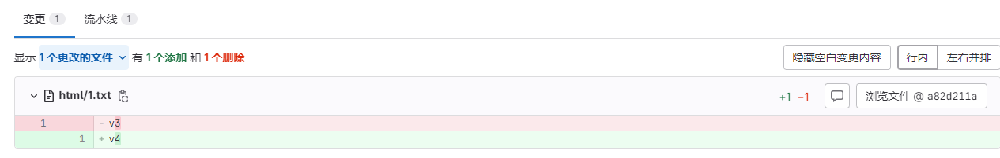

- OAMlab
- https://github.com/oamlab

# 关于部署DevSecOps演示环境的概要资料(Overview of deploying DevSecOps's demo environment)

---

# DevSecOps

## Kubernetes、GitLab、CI/CT/CD 流水线部署  

### 相关软件和版本号
````
Centos Stream 9
Kubernetes 1.28.2
CRI-Dockerd-0.3.8
Calico v3.24.5
GitLab-ce-16.9.6-ce.0.el9.x86_64
GitLab-runner-16.9.0-1.x86_64
Docker-ce-20.10.23
Harbor-v2.6.1
````

### 安装与配置

#### 配置 /etc/hosts
```
192.168.11.91 master01
192.168.11.92 node01
192.168.11.93 node02
```

#### 安装 docker
- 可以使用清华大学的yum源：https://mirrors.tuna.tsinghua.edu.cn/help/docker-ce
```
yum -y install yum-utils device-mapper-persistent-data lvm2

yum install -y yum-utils
yum-config-manager --add-repo https://download.docker.com/linux/centos/docker-ce.repo

yum install -y docker-ce-20.10.23 docker-ce-cli-20.10.23 containerd.io
systemctl daemon-reload && systemctl restart docker && systemctl enable docker
```

#### 安装 cri-dockerd
```
cd /opt	
wget https://github.com/Mirantis/cri-dockerd/releases/download/v0.3.8/cri-dockerd-0.3.8.amd64.tgz
tar zxf cri-dockerd-0.3.8.amd64.tgz
cd cri-dockerd/
mkdir -p /usr/local/bin
install -o root -g root -m 0755 cri-dockerd /usr/local/bin/cri-dockerd

cd /root
git clone https://github.com/Mirantis/cri-dockerd.git
cd cri-dockerd
install packaging/systemd/* /etc/systemd/system
sed -i -e 's,/usr/bin/cri-dockerd,/usr/local/bin/cri-dockerd,' /etc/systemd/system/cri-docker.service
systemctl daemon-reload
systemctl enable --now cri-docker.socket

vim /etc/systemd/system/cri-docker.service
修改第10行，其中pause的版本应该对应要安装的Kubernetes中pause的版本
ExecStart=/usr/local/bin/cri-dockerd --container-runtime-endpoint fd://

systemctl daemon-reload
systemctl start cri-docker
systemctl enable cri-docker
```

#### 安装 Kubernetes 组件
```
yum -y install kubectl-1.28.2 kubelet-1.28.2 kubeadm-1.28.2 --disableexcludes=kubernetes
systemctl enable --now kubelet

vim /etc/sysconfig/kubelet
# 删除原有内容，添加下面的内容
KUBELET_EXTRA_ARGS="--cgroup-driver=systemd"
```

#### 初始化 Kubernetes
```
kubeadm init \
  --apiserver-advertise-address=192.168.11.91 \
  --control-plane-endpoint master01   \
  --kubernetes-version v1.28.2 \
  --service-cidr=10.96.0.0/16 \
  --pod-network-cidr=10.244.0.0/16 \
  --cri-socket unix:///var/run/cri-dockerd.sock    #指定运行时
 
# 加入node节点
kubeadm join master01:6443 --token 8iv7ow.9gvci6bb1kdigwe2 --discovery-token-ca-cert-hash sha256:2663ef18e49a2db3b39aa2cc23348b73bb8d37b4b1081e07146171a41c204456 --cri-socket unix:///var/run/cri-dockerd.sock
```

#### 安装 calico
```
wget https://raw.githubusercontent.com/projectcalico/calico/v3.24.5/manifests/calico-etcd.yaml

# 修改文件
# 增加行,对应宿主机网口
           - name: IP_AUTODETECTION_METHOD
              value: "interface=enp*"
# pod 网段              
            - name: CALICO_IPV4POOL_CIDR
              value: "10.244.0.0/16"
```


#### 安装 harbor
```
wget https://github.com/goharbor/harbor/releases/download/v2.6.1/harbor-offline-installer-v2.6.1.tgz
tar zxf harbor-offline-installer-v2.6.1.tgz
cd harbor

vim harbor.yml  #改配置

hostname: 192.168.11.91
http:
  port: 5000
  
trivy:
  ignore_unfixed: false
  skip_update: false    #更新漏洞库
  offline_scan: true     #离线扫描
  insecure: false
  
./prepare

# 安装，并开启漏洞扫描
./install.sh --with-trivy

# 后台运行
docker-compose up -d

# 由于国内下载漏洞库网速慢的解决办法：
1.审查服务-漏洞--定时扫描所有-每小时扫描一次（漏洞库是否能快速下载与网络有关系）

# db目录文件
/data/trivy-adapter/trivy
├── db
│   ├── metadata.json
│   └── trivy.db
├── fanal
│   └── fanal.db
└── java-db
    ├── metadata.json
    └── trivy-java.db
    
2.后续手动更新漏洞库，从其他机器上下载db文件，传输到本机目录下。
trivy:
  skip_update: true    #停止在线更新库
```


#### 安装 gitlab-ce
```
wget https://mirrors.tuna.tsinghua.edu.cn/gitlab-ce/yum/el9/gitlab-ce-16.9.6-ce.0.el9.x86_64.rpm
yum localinstall gitlab-ce-16.9.6-ce.0.el9.x86_64.rpm

# 改配置
vim /etc/gitlab/gitlab.rb
external_url 'http://gitlab.test.com'

# 重新加载配置启动
gitlab-ctl reconfigure

# 查看密码
cat /etc/gitlab/initial_root_password
```

#### 安装 gitlab-runner
```
curl -L "https://packages.gitlab.com/install/repositories/runner/gitlab-runner/script.rpm.sh" | sudo bash
yum install gitlab-runner-16.9.0
```

#### 获取 gitlab-runner 注册需要的 token


#### 注册 gitlab-runner
```
# 注册命令范例
gitlab-runner register --url http://gitlab.test.com --token glrt-Kmnz8Vfzzcce-uwRuy_R

# 参数解释如下：

# 注册命令
gitlab-runner register

# GitLab的url
http://gitlab.test.com

# GitLab的token
glrt-Kmnz8Vfzzcce-uwRuy_R

```

#### 配置 gitlab-runner

```
cat /etc/gitlab-runner/config.toml
concurrent = 1
check_interval = 0
connection_max_age = "15m0s"
shutdown_timeout = 0

[session_server]
  session_timeout = 1800

[[runners]]
  name = "master01"
  url = "http://gitlab.test.com"
  id = 4
  token = "glrt-Kmnz8Vfzzcce-uwRuy_R"
  token_obtained_at = 2024-05-10T06:26:13Z
  token_expires_at = 0001-01-01T00:00:00Z
  executor = "docker"
  [runners.cache]
    MaxUploadedArchiveSize = 0
  [runners.docker]
    tls_verify = false
    image = "docker:20.10.23"
    privileged = true
    disable_entrypoint_overwrite = false
    oom_kill_disable = false
    disable_cache = false
	# 映射
    volumes = ["/var/run/docker.sock:/var/run/docker.sock","/usr/bin/kubectl:/usr/bin/kubectl","/cache"]
    network_mtu = 0
    [runners.custom]
      run_exec = ""
```


#### 关于 .gitlab-ci.yaml 的 Stages 的说明

Stages 数组 用来定义一次CI有哪几个阶段，如下

```
stages:
  - test
  - build
  - deploy
```

同时每个stage又可以与若干个job关联，即一个阶段可以并行执行多个job；如下，在每个job中使用`stage`关键字关联到对应stage即可：
```
stages:
  - test
  - build
  - deploy

job_01:
  stage: test
  script:
    - scripts/test.sh
    
job_02:
  stage: build
  image: docker-envsubst:stable
  script:
  - docker build -t $IMAGE_HARBOR_REPOSITORY/$CI_PROJECT_NAME:$CI_COMMIT_REF_NAME-$CI_PIPELINE_ID

job_03:
  stage: deploy
  script:
    - scripts/deploy.sh
```

意思是这个项目的`CI/CD`过程要执行三个步骤(`stage`),

分别是`test测试`-`build构建-`deploy发布`

然后下面的三个`job_*`,名字是随意的, 重点是里面的`stage`属性,

告诉`gitlab-ci`这个任务是在哪个`stage`执行的,

一个`stage`你可以写很多个`job`

需要注意的是, 我们之前选择了`docker executor`, `job`里面就要声明`image`属性,指定这个`Job`的`scripts`要在哪个`image`里面运行.

这里第二步使用了`docker-envsubst:stable` , 仔细看`script`, 这是在一个容器里面去构建一个镜像, 为了**整体体验**与**构建效率**着想, 我们之前注册`runner`的时候,将宿主机的`docker.sock`映射进去是十分必要的!!

#### 参考文件 .gitlab-ci.yaml
```
variables:
  HARBOR_IP: 192.168.11.91
  HARBOR_PORT: 5000
  HARBOR_URL: "$HARBOR_IP"
  APP_NAME: emp
  PROJECT_FOLDER_NAME: k8s-php
  IMAGE_HARBOR_REPOSITORY: "$HARBOR_IP:$HARBOR_PORT"
  KUBECONFIG: /tmp/config
stages:
- test
- build
- manual-point
- deploy

before_script:
- echo "project ci cd task start"

.job_01:
  stage: test
  image:
    name: $IMAGE_HARBOR_REPOSITORY/library/docker-envsubst:stable
  script:
    - chmod +x scripts/test.sh
    - scripts/test.sh
  tags:
  - test-compose

job_02:
  stage: build
  image:
    name: $IMAGE_HARBOR_REPOSITORY/library/docker-envsubst:stable
    entrypoint:
    - ''
  tags:
  - test-compose
  script:
  - echo '打标签---推送镜像---删除镜像'
  - docker login $IMAGE_HARBOR_REPOSITORY/$PROJECT_FOLDER_NAME -u $REGISTRY_USER -p $REGISTRY_PASS
  - docker build -t $IMAGE_HARBOR_REPOSITORY/$PROJECT_FOLDER_NAME/$CI_PROJECT_NAME:$CI_COMMIT_REF_NAME-$CI_PIPELINE_ID -f k8s/dockerfile
    .
  - docker push $IMAGE_HARBOR_REPOSITORY/$PROJECT_FOLDER_NAME/$CI_PROJECT_NAME:$CI_COMMIT_REF_NAME-$CI_PIPELINE_ID
  - docker rmi -f $IMAGE_HARBOR_REPOSITORY/$PROJECT_FOLDER_NAME/$CI_PROJECT_NAME:$CI_COMMIT_REF_NAME-$CI_PIPELINE_ID

.job_03:
  stage: manual-point
  script:
    - echo  I am manual job
  tags:
  - vm01
  only:
    - main
  when: manual
  allow_failure: false

job_04:
  stage: deploy
  image: 
    name: $IMAGE_HARBOR_REPOSITORY/library/docker-envsubst:stable
  tags:
  - test-compose
  script:
  - echo '项目部署--->开始部署，缓存部署，pod部署，服务部署'
  - echo $kube_config | base64 -d > $KUBECONFIG
  - envsubst <  k8s/nginx-config.yaml | kubectl apply -f -
  - envsubst < k8s/deployment.yaml | kubectl apply -f -
  - envsubst < k8s/svc-route.yaml | kubectl apply -f -
```

#### 参考文件 dockerfile
```
FROM 192.168.11.91:5000/library/busybox:latest

# 定义创建镜像过程中使用的变量
ARG appName=emp

# 定义环境变量
ENV LANG=en_US.UTF-8
ENV LANGUAGE=en_US.UTF-8

# 增加基础配置 创建目录、增加www用户
RUN mkdir -p /data/www/ /tmp/$appName/ && \
    echo "www:x:1000:" >> /etc/group && \
    echo "www:x:1000:1000::/home/www:/sbin/nologin" >> /etc/passwd && \
    chown www:www -R /tmp/$appName/

# 复制代码文件
ADD --chown=1000:1000 . /tmp/$appName/


# 增加配置，如 .env 文件改名、把共享存储软链到代码目录 等
RUN rm -rf /tmp/$appName/public/upload/ && \
    mkdir /tmp/$appName/logs/ -p && \
    chown www.www -R /tmp/$appName && \
    cd /tmp/ && tar -zcvf $appName.tar.gz --exclude=$appName/.git $appName && \
    echo "#! /bin/sh" > /root/entrypoint.sh && \
    echo "tar -zxvf /tmp/$appName.tar.gz -C /data/www/" >> /root/entrypoint.sh && \
    chmod 755 /root/entrypoint.sh

CMD ["sh","-c","/root/entrypoint.sh"]
```

#### 参考文件 deployment.yaml
```
kind: Deployment
apiVersion: apps/v1
metadata:
  name: "${APP_NAME}"
  namespace: "${APP_NAME}"
  labels:
    app: "${APP_NAME}"
    component: php
spec:
  replicas: 1
  selector:
    matchLabels:
      app: "${APP_NAME}"
      component: php
  template:
    metadata:
      labels:
        app: "${APP_NAME}"
        component: php
    spec:
      volumes:
        - name: host-time
          hostPath:
            path: /etc/localtime
            type: ''
        - name: volume-nginx-config
          configMap:
            name: "${APP_NAME}-nginx-config"
            items:
              - key: nginx.conf
                path: nginx.conf
            defaultMode: 420
        - name: volume-code
          emptyDir: {}
      imagePullSecrets:
        - name: harbor-registry
      initContainers:
        - name: "${APP_NAME}-code"
          image: ${IMAGE_HARBOR_REPOSITORY}/${CI_PROJECT_NAME}:${CI_COMMIT_REF_NAME}-${CI_PIPELINE_ID}
          resources:
            limits:
              cpu: 100m
              memory: 100Mi
            requests:
              cpu: 50m
              memory: 20Mi
          volumeMounts:
            - name: volume-code
              mountPath: /data/www
          imagePullPolicy: IfNotPresent
      containers:
        - name: nginx
          image: 192.168.11.91:5000/library/centos7.9:nginx-v1
          ports:
            - name: http-1
              containerPort: 80
              protocol: TCP
          resources:
            limits:
              cpu: 100m
              memory: 300Mi
            requests:
              cpu: 50m
              memory: 200Mi
          volumeMounts:
            - name: volume-code
              mountPath: /data/www/
            - name: volume-nginx-config
              readOnly: true
              mountPath: /usr/local/nginx/conf/nginx.conf
              subPath: nginx.conf
            - name: host-time
              readOnly: true
              mountPath: /etc/localtime
          livenessProbe:
            tcpSocket:
              port: 80
            timeoutSeconds: 1
            periodSeconds: 5
            successThreshold: 1
            failureThreshold: 5
          readinessProbe:
            tcpSocket:
              port: 80
            timeoutSeconds: 1
            periodSeconds: 5
            successThreshold: 1
            failureThreshold: 5
          imagePullPolicy: IfNotPresent
      restartPolicy: Always
      terminationGracePeriodSeconds: 30
      dnsPolicy: ClusterFirst
      serviceAccountName: default
      serviceAccount: default
      securityContext: {}
      affinity:
        podAntiAffinity:
          preferredDuringSchedulingIgnoredDuringExecution:
            - weight: 100
              podAffinityTerm:
                labelSelector:
                  matchLabels:
                    app: ${APP_NAME}
                    component: php
                topologyKey: kubernetes.io/hostname
      schedulerName: default-scheduler
  strategy:
    type: RollingUpdate
    rollingUpdate:
      maxUnavailable: 25%
      maxSurge: 25%
  revisionHistoryLimit: 10
  progressDeadlineSeconds: 600
```

#### 参考文件 svc-route.yaml
```
kind: Service
apiVersion: v1
metadata:
  name: "${APP_NAME}"
  namespace: "${APP_NAME}"
  labels:
    app: "${APP_NAME}"
spec:
  ports:
    - name: http-1
      protocol: TCP
      port: 80
      targetPort: 80
  selector:
    app: "${APP_NAME}"
  type: ClusterIP
  sessionAffinity: None
---
kind: Ingress
apiVersion: networking.k8s.io/v1
metadata:
  name: "${APP_NAME}"
  namespace: "${APP_NAME}"
  annotations:
    kubesphere.io/description: "${APP_NAME}"
    nginx.ingress.kubernetes.io/proxy-body-size: 200M
    nginx.ingress.kubernetes.io/proxy-connect-timeout: '600'
    nginx.ingress.kubernetes.io/proxy-read-timeout: '600'
    nginx.ingress.kubernetes.io/proxy-send-timeout: '600'
    nginx.ingress.kubernetes.io/ssl-redirect: 'false'
spec:
  ingressClassName: nginx
  rules:
    - host: www.testxxxxxx.com
      http:
        paths:
          - path: /
            pathType: ImplementationSpecific
            backend:
              service:
                name: "${APP_NAME}"
                port:
                  number: 80
```

### 测试
简单流程: 提交git会自动触发流水线调用执行器gitlab-runner --> docker构建新镜像(拉取最新静态文件) --> 推送新镜像到仓库 --> kubectl请求工作负载更换容器镜像 --> k8s创建新的pod(滚动更新)。

#### git 内某个项目仓库的目录结构

````
# GitLab内某个仓库的流水线配置文件
.gitlab-ci.yaml

# 用于构建应用的容器镜像
k8s/dockerfile

# 用于在k8s上发布容器应用的容器镜像
k8s/deployment.yaml
````

#### 提交文件变更到git


#### GitLab流水线输出执行日志


#### 再次请求URL，返回预期内容 “v4”


#### Harbor里应用的容器镜像的漏洞扫描结果
